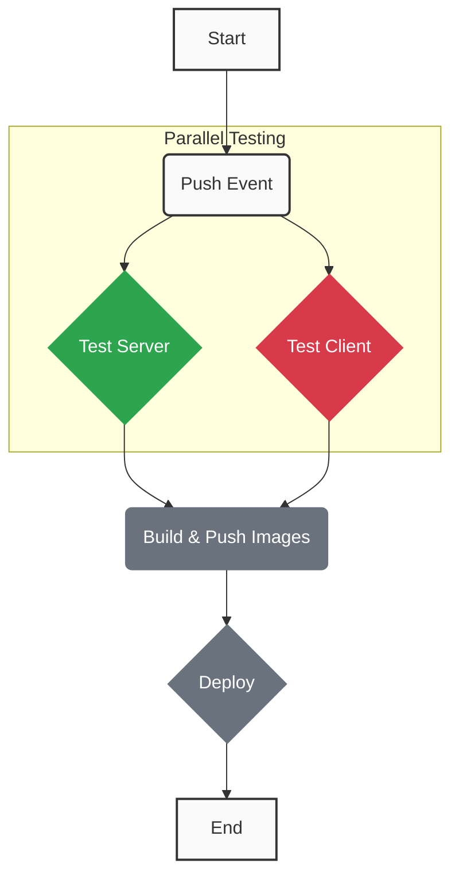

# My DevOps Project Dashboard

### CI/CD Pipeline Status

This badge shows the real-time status of the last run on the `main` branch.

---

### Pipeline Flowchart

This flowchart is updated automatically by our CI/CD pipeline after every run.

